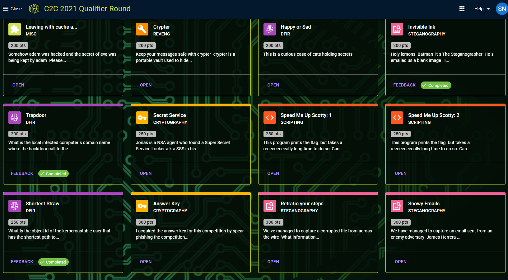

# Previous Fifth Domain Challenges

Just a very unorganised repository of previous Fifth Domain challenges that will be shared with everyone if they reuse challenges for the BSides CTF.

I will not try to neaten these up since I can't be bothered.

I feel guilty that I did not bring this up during the C2C CTF, and that's why I want to remedy the reuse issue and want everyone to forgive my sins.

**Competition CTFs should not have reused challenges! We all want to learn something new and have fun!**

## Screenshots of Previous CTFs

**ADF Cyber GAP CTF**


**C2C Qualifiers**





*Forgot to take screenshots for the C2C finals (my deep hatred of guessy steg challenges prevented me).*

## Flags that I Cannot Remember the Challenge Name

```
something about an encrypted ppm: flag{blocky_by_de_sign}
think it was dumped creds: flag{warren:lizard11}
Some crypto challenge (Very Secure Protocol): FLAG{wh4dy4_m3an_32_b1t5_1s_1n53cur3}
9 Lives (I forgot the name but was reminded by someone else): flag{rachmaninoff2021}
```
